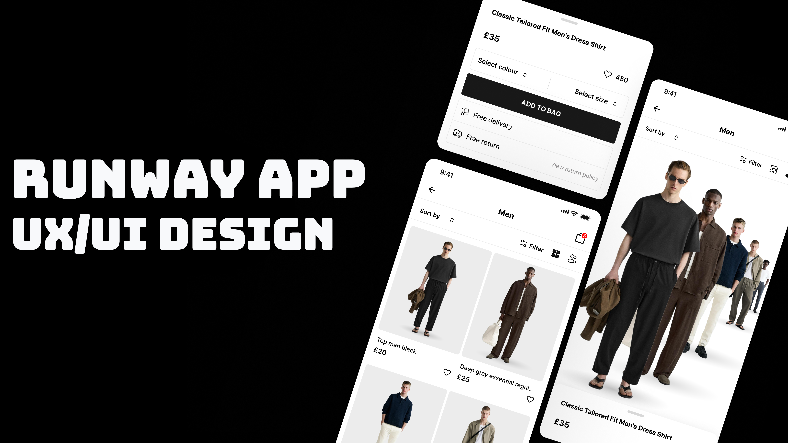

# Runway

<!-- Preview Image -->
<p align="center">
  
</p>

## Overview
Runway is a modern, elegant fashion e-commerce app built with Flutter, designed for training in UI development and showcasing beautiful user interface designs. The app features a sophisticated video-based homepage with category browsing, product details with interactive bottom sheets, and a clean, minimalist design aesthetic. Built for learning purposes, it demonstrates advanced Flutter UI techniques including video integration, custom animations, and responsive layouts.

## Features

- 🎬 **Video Background Homepage** - Immersive video experience with overlay categories
- 🛍️ **Product Categories** - Browse through Women, Men, Kids, Deals, and Health sections
- 📱 **Product Grid View** - Clean grid layout for product browsing
- 🖼️ **Product Details** - Interactive product pages with draggable bottom sheets
- 🎨 **Custom UI Components** - Reusable widgets for consistent design
- ✨ **Animated Splash Screen** - Elegant logo animation with shader effects
- 🎯 **Interactive Elements** - Gesture-based navigation and interactions
- 📐 **Responsive Design** - Optimized layouts for different screen sizes
- 🎭 **Modern Aesthetics** - Clean, minimalist design with premium feel

## Screenshots

### Home Screen
- Video background with category overlay
- Horizontal scrolling categories
- Smooth navigation transitions

### Categories Screen
- Grid-based product layout
- Filter and sort options
- Product item cards with hover effects

### Product Details
- Large product image display
- Draggable bottom sheet with product info
- Color and size selection options
- Add to bag functionality

## Getting Started

### Prerequisites
- Flutter SDK (3.8.0 or higher)
- Dart SDK
- Android Studio / VS Code
- Android/iOS emulator or physical device

### Installation

1. **Clone the repository:**
   ```bash
   git clone https://github.com/your-username/runway.git
   cd runway
   ```

2. **Install dependencies:**
   ```bash
   flutter pub get
   ```

3. **Run the app:**
   ```bash
   flutter run
   ```

### Dependencies
- `flutter_svg: ^2.2.1` - SVG image support
- `gap: ^3.0.1` - Spacing utility
- `video_player: ^2.10.0` - Video playback functionality

## Project Structure

```
lib/
├── main.dart                 # App entry point
├── models/                   # Data models
│   ├── category_model.dart   # Category data structure
│   └── product_model.dart    # Product data structure
├── screens/                  # App screens
│   ├── splash.dart          # Animated splash screen
│   ├── home.dart            # Video homepage with categories
│   ├── categories.dart      # Product grid view
│   └── products_detailes.dart # Product details with bottom sheet
└── widgets/                  # Reusable UI components
    ├── animation_line.dart   # Animated line component
    ├── category_filter.dart  # Filter and sort controls
    ├── custom_app_bar.dart   # Custom app bar widget
    └── product_item.dart     # Product card component
```

## Assets Structure

```
assets/
├── images/
│   ├── category/            # Category icons (Women, Men, Kids, etc.)
│   ├── models/              # Product model images
│   └── shadow.png           # Shadow overlay effect
├── logo/                    # App logo and branding
├── svgs/                    # Vector icons and graphics
└── video/                   # Background video files
```

## Key Features Explained

### Video Integration
The app uses `video_player` package to display background videos on the homepage, creating an immersive shopping experience.

### Custom Animations
- **Splash Animation**: Uses `ShaderMask` and `AnimationController` for logo reveal effect
- **Bottom Sheet**: Draggable scrollable sheet for product details
- **Smooth Transitions**: Custom page transitions and gesture handling

### UI Components
- **Custom App Bar**: Flexible app bar with SVG icons and navigation
- **Product Cards**: Reusable product display components
- **Filter Controls**: Sort and filter interface elements

## Development Notes

This project is designed for **UI training and learning purposes**. It demonstrates:

- Advanced Flutter UI techniques
- Video integration in mobile apps
- Custom animation implementations
- Responsive design patterns
- Component-based architecture
- Asset management best practices

## Contributing

This is a learning project. Feel free to:
- Fork the repository
- Experiment with UI modifications
- Add new features for practice
- Improve existing components

## License

This project is open source and available under the [MIT License](LICENSE).

---

> **Developed with ❤️ using Flutter for UI training and learning purposes.**